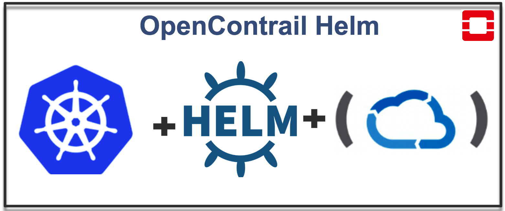
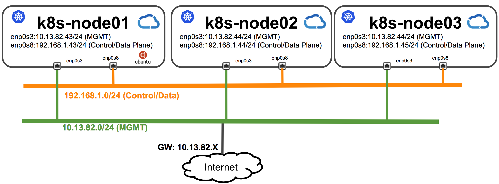

# Installation guide for Contrail HA and Openstack-Helm Ocata


This installation procedure will use Juniper OpenStack Helm infra and OpenStack Helm repo for OpenStack/OpenContrail Ocata clsuter Multi-node deployment.

### Tested with

1. Operating system: Ubuntu 16.04.3 LTS
2. Kernel: 4.4.0-87-generic
3. docker: 1.13.1-cs9
4. helm: v2.7.2
5. kubernetes: v1.9.3
6. openstack: Ocata

### Multinode Topology Diagram

### Pre-requisites

1. Generate SSH key on master node and copy to all nodes, in below example three nodes with IP addresses 10.13.82.43, 10.13.82.44 & 10.13.82.45 is used.

 ```bash
(k8s-master)> ssh-keygen

(k8s-master)> ssh-copy-id -i ~/.ssh/id_rsa.pub 10.13.82.43
(k8s-master)> ssh-copy-id -i ~/.ssh/id_rsa.pub 10.13.82.44
(k8s-master)> ssh-copy-id -i ~/.ssh/id_rsa.pub 10.13.82.45
 ```

2. Please make sure in all nodes NTP is configured and each node is sync to time-server as per your environment. In below example NTP server IP is "10.84.5.100".

```bash
 (k8s-all-nodes)> ntpq -pn
     remote           refid      st t when poll reach   delay   offset  jitter
==============================================================================
*10.84.5.100     66.129.255.62    2 u   15   64  377   72.421  -22.686   2.628
```

3. Git clone the necessary repo's using below command

  ```bash
  # Download openstack-helm code on **all Nodes**
  (k8s-all-nodes)> git clone https://github.com/Juniper/openstack-helm.git /opt/openstack-helm
  # Download openstack-helm-infra code on **all Nodes**
  (k8s-all-nodes)> git clone https://github.com/Juniper/openstack-helm-infra.git /opt/openstack-helm-infra
  # Download contrail-helm-deployer code on **Master node only**
  (k8s-all-nodes)> git clone https://github.com/tungstenfabric/tf-helm-deployer.git /opt/contrail-helm-deployer
  ```

4. Export variables needed by below procedure

  ```bash
  (k8s-master)> cd /opt
  (k8s-master)> export BASE_DIR=$(pwd)
  (k8s-master)> export OSH_PATH=${BASE_DIR}/openstack-helm
  (k8s-master)> export OSH_INFRA_PATH=${BASE_DIR}/openstack-helm-infra
  (k8s-master)> export CHD_PATH=${BASE_DIR}/contrail-helm-deployer
  ```

5. Installing necessary packages.

  ```bash
  (k8s-master)> cd ${OSH_PATH}
  (k8s-master)> ./tools/deployment/developer/common/001-install-packages-opencontrail.sh

  (k8s-slave)> sudo apt-get update -y
  (k8s-slave)> sudo apt-get install --no-install-recommends -y git
  ```

6. Create an inventory file on the master node for ansible base provisoning, please note in below output 10.13.82.43/.44/.45 are nodes IP addresses and will use SSH-key generated in step 1. Refer to `${OSH_INFRA_PATH}/tools/gate/devel/sample-contrail-multinode-inventory.yaml` for much more options

Sample `multinode-inventory.yaml`

```bash
(k8s-master)> set -xe
(k8s-master)> cat > /opt/openstack-helm-infra/tools/gate/devel/multinode-inventory.yaml <<EOF
all:
  children:
    primary:
      hosts:
        node_one:
          ansible_port: 22
          ansible_host: 10.13.82.43
          ansible_user: root
          ansible_ssh_private_key_file: /root/.ssh/id_rsa
          ansible_ssh_extra_args: -o StrictHostKeyChecking=no
    nodes:
      children:
        openstack-compute:
          children:
            contrial-vrouter-kernel:
              hosts:
                node_two:
                  ansible_port: 22
                  ansible_host: 10.13.82.44
                  ansible_user: root
                  ansible_ssh_private_key_file: /root/.ssh/id_rsa
                  ansible_ssh_extra_args: -o StrictHostKeyChecking=no
                node_three:
                  ansible_port: 22
                  ansible_host: 10.13.82.45
                  ansible_user: root
                  ansible_ssh_private_key_file: /root/.ssh/id_rsa
                  ansible_ssh_extra_args: -o StrictHostKeyChecking=no
EOF
```

7. By default k8s v1.9.3, helm v2.7.2 and cni (v0.6.0) are installed. If you would want to install a different version then edit `${OSH_INFRA_PATH}/tools/gate/devel/multinode-vars.yaml` file to override default values given in `${OSH_INFRA_PATH}/playbooks/vars.yaml`. Refer to `${OSH_INFRA_PATH}/tools/gate/devel/sample-contrail-multinode-vars.yaml` for much more options

Sample `multinode-vars.yaml`, in this example primary node is also contrail-controller node, hence opencontrail.org/controller label is specified under primary nodes

 ```bash
(k8s-master)> cat > /opt/openstack-helm-infra/tools/gate/devel/multinode-vars.yaml <<EOF
# version fields
version:
  kubernetes: v1.9.3
  helm: v2.7.2
  cni: v0.6.0

kubernetes:
  network:
    # enp0s8 is your control/data interface, to which kubernetes will bind to
    default_device: enp0s8
  cluster:
    cni: calico
    pod_subnet: 192.168.0.0/16
    domain: cluster.local
docker:
  # list of insecure_registries, from where you will be pulling container images
  insecure_registries:
    - "10.87.65.243:5000"
  # list of private secure docker registry auth info, from where you will be pulling container images
  #private_registries:
  #  - name: <docker-registry-name>
  #    username: username@abc.xyz
  #    email: username@abc.xyz
  #    password: password
  #    secret_name: contrail-image-secret
  #    namespace: openstack
nodes:
  labels:
    primary:
    - name: openstack-helm-node-class
      value: primary
    - name: openstack-control-plane
      value: enabled
    - name: ceph-mon
      value: enabled
    - name: ceph-osd
      value: enabled
    - name: ceph-mds
      value: enabled
    - name: ceph-rgw
      value: enabled
    - name: ceph-mgr
      value: enabled
    - name: opencontrail.org/controller
      value: enabled
    all:
    - name: openstack-helm-node-class
      value: general
    openstack-compute:
    - name: openstack-compute-node
      value: enabled
    contrial-vrouter-kernel:
    - name: opencontrail.org/vrouter-kernel
      value: enabled
EOF
```

8. Run the playbooks on master node

  ```bash
(k8s-master)> set -xe
(k8s-master)> cd ${OSH_INFRA_PATH}
(k8s-master)> make dev-deploy setup-host multinode
(k8s-master)> make dev-deploy k8s multinode
 ```

9. Verify kube-dns connection from all nodes.

Use `nslookup` to verify that you are able to resolve k8s cluster specific names

```bash
  (k8s-all-nodes)> nslookup
  > kubernetes.default.svc.cluster.local
  Server:         10.96.0.10
  Address:        10.96.0.10#53

  Non-authoritative answer:
  Name:   kubernetes.default.svc.cluster.local
  Address: 10.96.0.1
```

### Installation of OpenStack Helm Charts

Use below commands to verify labelling of nodes

```bash
(k8s-master)> kubectl get nodes -l openstack-compute-node=enabled
(k8s-master)> kubectl get nodes -l openstack-control-plane=enabled
(k8s-master)> kubectl get nodes -l opencontrail.org/controller=enabled
(k8s-master)> kubectl get nodes -l opencontrail.org/vrouter-kernel=enabled
```

1. Deploy OpenStack Helm charts using following commands.

```bash
  (k8s-master)> set -xe
  (k8s-master)> cd ${OSH_PATH}

  (k8s-master)> ./tools/deployment/multinode/010-setup-client.sh
  (k8s-master)> ./tools/deployment/multinode/021-ingress-opencontrail.sh
  (k8s-master)> ./tools/deployment/multinode/030-ceph.sh
  (k8s-master)> ./tools/deployment/multinode/040-ceph-ns-activate.sh
  (k8s-master)> ./tools/deployment/multinode/050-mariadb.sh
  (k8s-master)> ./tools/deployment/multinode/060-rabbitmq.sh
  (k8s-master)> ./tools/deployment/multinode/070-memcached.sh
  (k8s-master)> ./tools/deployment/multinode/080-keystone.sh
  (k8s-master)> ./tools/deployment/multinode/090-ceph-radosgateway.sh
  (k8s-master)> ./tools/deployment/multinode/100-glance.sh
  (k8s-master)> ./tools/deployment/multinode/110-cinder.sh
  (k8s-master)> ./tools/deployment/multinode/131-libvirt-opencontrail.sh
  # Edit ${OSH_PATH}/tools/overrides/backends/opencontrail/nova.yaml and
  # ${OSH_PATH}/tools/overrides/backends/opencontrail/neutron.yaml
  # to make sure that you are pulling init container image from correct registry and tag
  (k8s-master)> ./tools/deployment/multinode/141-compute-kit-opencontrail.sh
  (k8s-master)> ./tools/deployment/developer/ceph/100-horizon.sh
```

#### Installation of Contrail Helm charts

1. Now deploy opencontrail charts

```bash
 (k8s-master)> cd $CHD_PATH
 (k8s-master)> make

 # Please note in below example, 192.168.1.0/24 is "Control/Data" network
 # Export variables
 (k8s-master)> export CONTROLLER_NODES="192.168.1.43,192.168.1.44,192.168.1.45"
 (k8s-master)> export VROUTER_GATEWAY="192.168.1.1"
 (k8s-master)> export BGP_PORT="1179"

 # [Optional] By default, it will pull latest image from opencontrailnightly

 (k8s-master)> export CONTRAIL_REGISTRY="opencontrailnightly"
 (k8s-master)> export CONTRAIL_TAG="latest"

 # [Optional] only if you are pulling images from a private docker registry
 export CONTRAIL_REG_USERNAME="abc@abc.com"
 export CONTRAIL_REG_PASSWORD="password"

 tee /tmp/contrail-env-images.yaml << EOF
 global:
   contrail_env:
     CONTROLLER_NODES: ${CONTROLLER_NODES}
     CONTROL_NODES: ${CONTROL_NODES:-CONTROLLER_NODES}
     VROUTER_GATEWAY: ${VROUTER_GATEWAY}
     BGP_PORT: ${BGP_PORT}
   images:
     tags:
       kafka: "${CONTRAIL_REGISTRY:-opencontrailnightly}/contrail-external-kafka:${CONTRAIL_TAG:-latest}"
       cassandra: "${CONTRAIL_REGISTRY:-opencontrailnightly}/contrail-external-cassandra:${CONTRAIL_TAG:-latest}"
       redis: "${CONTRAIL_REGISTRY:-opencontrailnightly}/contrail-external-redis:${CONTRAIL_TAG:-latest}"
       zookeeper: "${CONTRAIL_REGISTRY:-opencontrailnightly}/contrail-external-zookeeper:${CONTRAIL_TAG:-latest}"
       contrail_control: "${CONTRAIL_REGISTRY:-opencontrailnightly}/contrail-controller-control-control:${CONTRAIL_TAG:-latest}"
       control_dns: "${CONTRAIL_REGISTRY:-opencontrailnightly}/contrail-controller-control-dns:${CONTRAIL_TAG:-latest}"
       control_named: "${CONTRAIL_REGISTRY:-opencontrailnightly}/contrail-controller-control-named:${CONTRAIL_TAG:-latest}"
       config_api: "${CONTRAIL_REGISTRY:-opencontrailnightly}/contrail-controller-config-api:${CONTRAIL_TAG:-latest}"
       config_devicemgr: "${CONTRAIL_REGISTRY:-opencontrailnightly}/contrail-controller-config-devicemgr:${CONTRAIL_TAG:-latest}"
       config_schema_transformer: "${CONTRAIL_REGISTRY:-opencontrailnightly}/contrail-controller-config-schema:${CONTRAIL_TAG:-latest}"
       config_svcmonitor: "${CONTRAIL_REGISTRY:-opencontrailnightly}/contrail-controller-config-svcmonitor:${CONTRAIL_TAG:-latest}"
       webui_middleware: "${CONTRAIL_REGISTRY:-opencontrailnightly}/contrail-controller-webui-job:${CONTRAIL_TAG:-latest}"
       webui: "${CONTRAIL_REGISTRY:-opencontrailnightly}/contrail-controller-webui-web:${CONTRAIL_TAG:-latest}"
       analytics_api: "${CONTRAIL_REGISTRY:-opencontrailnightly}/contrail-analytics-api:${CONTRAIL_TAG:-latest}"
       contrail_collector: "${CONTRAIL_REGISTRY:-opencontrailnightly}/contrail-analytics-collector:${CONTRAIL_TAG:-latest}"
       analytics_alarm_gen: "${CONTRAIL_REGISTRY:-opencontrailnightly}/contrail-analytics-alarm-gen:${CONTRAIL_TAG:-latest}"
       analytics_query_engine: "${CONTRAIL_REGISTRY:-opencontrailnightly}/contrail-analytics-query-engine:${CONTRAIL_TAG:-latest}"
       analytics_snmp_collector: "${CONTRAIL_REGISTRY:-opencontrailnightly}/contrail-analytics-snmp-collector:${CONTRAIL_TAG:-latest}"
       contrail_topology: "${CONTRAIL_REGISTRY:-opencontrailnightly}/contrail-analytics-topology:${CONTRAIL_TAG:-latest}"
       build_driver_init: "${CONTRAIL_REGISTRY:-opencontrailnightly}/contrail-vrouter-kernel-build-init:${CONTRAIL_TAG:-latest}"
       vrouter_agent: "${CONTRAIL_REGISTRY:-opencontrailnightly}/contrail-vrouter-agent:${CONTRAIL_TAG:-latest}"
       vrouter_init_kernel: "${CONTRAIL_REGISTRY:-opencontrailnightly}/contrail-vrouter-kernel-init:${CONTRAIL_TAG:-latest}"
       vrouter_dpdk: "${CONTRAIL_REGISTRY:-opencontrailnightly}/contrail-vrouter-agent-dpdk:${CONTRAIL_TAG:-latest}"
       vrouter_init_dpdk: "${CONTRAIL_REGISTRY:-opencontrailnightly}/contrail-vrouter-kernel-init-dpdk:${CONTRAIL_TAG:-latest}"
       nodemgr: "${CONTRAIL_REGISTRY:-opencontrailnightly}/contrail-nodemgr:${CONTRAIL_TAG:-latest}"
       contrail_status: "${CONTRAIL_REGISTRY:-opencontrailnightly}/contrail-status:${CONTRAIL_TAG:-latest}"
       node_init: "${CONTRAIL_REGISTRY:-opencontrailnightly}/contrail-node-init:${CONTRAIL_TAG:-latest}"
       dep_check: quay.io/stackanetes/kubernetes-entrypoint:v0.2.1
EOF
 ```

# [Mandatory] : Need to update hosts:default field for rabbitmq
Hosts config for the rabbitmq endpoint need to set to CONTROLLER Node IPs in
both contrail-controller/values.yaml & contrail-analytics/values.yaml file.

```bash
      endpoints:
        cluster_domain_suffix: cluster.local
        rabbitmq:
          auth:
            username: guest
            password: guest
          path: /
          scheme: rabbit
          port:
            amqp:
              default: 5673
          hosts:
            default: 10.10.0.4,10.10.0.5,10.10.0.6
          host_fqdn_override:
          default: null
          domain_override: null
          namespace: contrail
 ```

# [Optional] Install Base Analytics only
contrail analytics service consists of Base analytics, snmp and alarm components.
To install only the base analytics, need to set the following variables in
contrail-analytics/values.yaml file under manifests to false.

```bash
      manifests:
        daemonset_analytics_snmp: false
        daemonset_analytics_alarm: false
        
 ```

**Note:** If any other environment variables needs to be added, then you can add it in `values.yaml` file of respective charts

```bash
# [Optional] only if you are pulling contrail images from a private registry
tee /tmp/contrail-registry-auth.yaml << EOF
global:
  images:
    imageCredentials:
      registry: ${CONTRAIL_REGISTRY:-opencontrailnightly}
      username: ${CONTRAIL_REG_USERNAME}
      password: ${CONTRAIL_REG_PASSWORD}
EOF

# [Optional] only if you are pulling images from a private registry
export CONTRAIL_REGISTRY_ARG="--values=/tmp/contrail-registry-auth.yaml "
```

##### Commands to install contrail charts

```bash
  (k8s-master)> helm install --name contrail-thirdparty ${CHD_PATH}/contrail-thirdparty \
  --namespace=contrail \
  --values=/tmp/contrail-env-images.yaml \
  ${CONTRAIL_REGISTRY_ARG}

  (k8s-master)> helm install --name contrail-controller ${CHD_PATH}/contrail-controller \
  --namespace=contrail \
  --values=/tmp/contrail-env-images.yaml \
  ${CONTRAIL_REGISTRY_ARG}

  (k8s-master)> helm install --name contrail-analytics ${CHD_PATH}/contrail-analytics \
  --namespace=contrail \
  --values=/tmp/contrail-env-images.yaml \
  ${CONTRAIL_REGISTRY_ARG}

  # Edit contrail-vrouter/values.yaml and make sure that global.images.tags.vrouter_init_kernel is right. Image tag name will be different depending upon your linux. Also set the global.node.host_os to ubuntu or centos depending on your system

  (k8s-master)> helm install --name contrail-vrouter ${CHD_PATH}/contrail-vrouter \
  --namespace=contrail \
  --values=/tmp/contrail-env-images.yaml \
  ${CONTRAIL_REGISTRY_ARG}
```

2. Once Contrail PODs are up and running deploy OpenStack Heat chart using following command.

```bash
# Edit ${OSH_PATH}/tools/overrides/backends/opencontrail/nova.yaml and
# ${OSH_PATH}/tools/overrides/backends/opencontrail/heat.yaml  
# to make sure that you are pulling the right opencontrail init container image
(k8s-master)> ./tools/deployment/multinode/151-heat-opencontrail.sh
```

3. Run compute kit test using following command at the end.

  ```bash
(k8s-master)> ./tools/deployment/multinode/143-compute-kit-opencontrail-test.sh
  ```

### OSH Contrail Helm Clsuter basic testing

1. Basic Virtual Network and VMs testing

 ```bash
(k8s-master)> export OS_CLOUD=openstack_helm

(k8s-master)> openstack network create MGMT-VN
(k8s-master)> openstack subnet create --subnet-range 172.16.1.0/24 --network MGMT-VN MGMT-VN-subnet

(k8s-master)> openstack server create --flavor m1.tiny --image 'Cirros 0.3.5 64-bit' \
--nic net-id=MGMT-VN \
Test-01

(k8s-master)> openstack server create --flavor m1.tiny --image 'Cirros 0.3.5 64-bit' \
--nic net-id=MGMT-VN \
Test-02
 ```

### Reference

* <https://github.com/Juniper/openstack-helm/blob/master/doc/source/install/multinode.rst>

### [FAQ's](faq.md)
